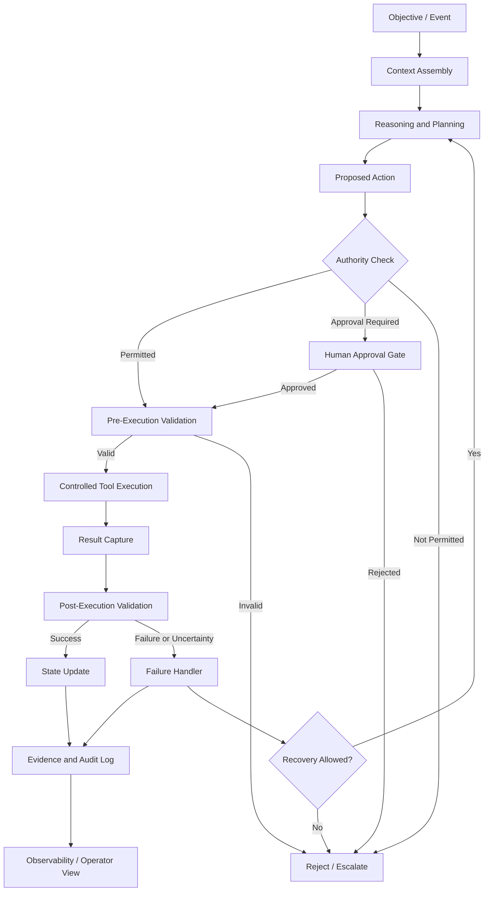

# Bounded Agentic Execution Architecture
[](https://github.com/RizAISystems/bounded-agentic-execution-architecture/actions/workflows/tests.yml)

A reference architecture for AI systems that can reason, select tools and execute actions while remaining inside explicit authority, validation and observability boundaries.

The objective is not maximum autonomy.

The objective is **useful autonomy with controlled authority, evidence and accountability.**

## Why this architecture exists

Most AI systems stop at generation or recommendation.

A more capable system may need to:

1. interpret changing context
2. determine what should happen next
3. select appropriate tools or services
4. determine whether an action is permitted
5. request approval when authority is insufficient
6. execute permitted actions
7. validate the result
8. preserve state and evidence
9. detect failure or uncertainty
10. escalate rather than exceed its authority

The engineering challenge is therefore not simply reasoning quality.

It is the design of the complete control system around reasoning.

## Architecture



## Core design principles

### 1. Reasoning does not imply authority

The system may determine that an action is desirable without being authorized to perform it.

Reasoning and execution authority remain separate concerns.

### 2. Every consequential action crosses an authority boundary

Actions are classified before execution.

A policy layer determines whether the system may:

- execute automatically
- execute within defined limits
- request human approval
- reject the action
- escalate to an operator

### 3. Validation occurs before and after execution

Pre-execution validation checks whether the proposed action is structurally valid, contextually appropriate and permitted.

Post-execution validation determines whether the intended result actually occurred.

### 4. Tools are capabilities, not permissions

Availability of a tool does not give the agent permission to use it.

The tool registry describes what can technically be done.

The authority model determines what may be done.

### 5. Evidence is part of execution

The system records enough information to reconstruct consequential decisions and actions.

Typical evidence includes:

- triggering objective or event
- relevant context
- proposed action
- authority decision
- approval state
- tool invocation
- execution result
- validation result
- state transition
- failure or recovery path

### 6. Failure should reduce autonomy

When confidence, data quality, system state or validation degrades, the architecture moves toward a safer operating state.

Failure does not justify expanding authority.

## Reference control loop

```text
OBSERVE
  ↓
INTERPRET
  ↓
REASON
  ↓
PROPOSE
  ↓
CHECK AUTHORITY
  ↓
VALIDATE
  ↓
EXECUTE
  ↓
VERIFY
  ↓
RECORD
  ↓
CONTINUE / RECOVER / ESCALATE
```

## Authority model

A simple implementation can classify actions into four levels:

| Level | Meaning | Example behavior |
|---|---|---|
| A0 | Observe only | Read state, analyze, recommend |
| A1 | Low-risk bounded action | Execute within predefined limits |
| A2 | Approval required | Prepare action and request authorization |
| A3 | Prohibited | Refuse execution and escalate |

Authority should be evaluated against the **specific action, current context and operating state**, not assigned permanently to the model.

## Execution contract

Before an external action is executed, the system should be able to answer:

```text
WHAT is being done?
WHY is it being done?
WHICH tool will perform it?
WHAT authority permits it?
WHAT limits apply?
HOW will success be verified?
WHAT happens if it fails?
WHAT evidence will be preserved?
```

If those questions cannot be answered, execution should not proceed.

## Failure handling

Failure modes should be explicit rather than treated as generic exceptions.

Examples include:

- stale or incomplete context
- unavailable external service
- malformed tool response
- authority violation
- validation failure
- contradictory state
- exceeded retry budget
- unexpected side effect
- insufficient confidence

Possible responses include:

```text
retry
repair
degrade capability
request approval
switch to observation-only mode
halt the workflow
escalate to an operator
```

## Observability

A production implementation should expose more than application logs.

Operators should be able to see:

- current objective
- workflow state
- proposed and completed actions
- authority decisions
- pending approvals
- external tool status
- validation state
- retry and recovery activity
- evidence references
- current autonomy level

The system should make failure visible rather than silently compensating for it.

## What this architecture is not

This is not a design for unrestricted autonomous agents.

It does not assume that an AI system should:

- decide its own authority
- silently expand its permissions
- modify production policy without authorization
- conceal failed actions
- treat successful tool access as permission
- continue indefinitely when validation is unavailable

The architecture is deliberately bounded.

## Intended applications

The pattern can be adapted to:

- enterprise AI agents
- operational automation
- engineering workflows
- decision support systems
- AI-assisted infrastructure operations
- financial workflows
- industrial systems
- multi-agent orchestration
- human-in-the-loop execution systems

The domain may change.

The control architecture remains largely the same.

## Repository roadmap

This repository will expand the reference architecture with:

- authority policy examples
- synthetic tool interfaces
- execution state models
- evidence schemas
- failure and recovery examples
- test scenarios
- a small working reference implementation

## Author

**Riz Datoo**  
Intelligent Autonomous Systems Architect

[Engineering Portfolio](https://riz-ai.rz07860.chatgpt.site/)  
[LinkedIn](https://www.linkedin.com/in/rizrz)  
[X](https://x.com/RizD200)
